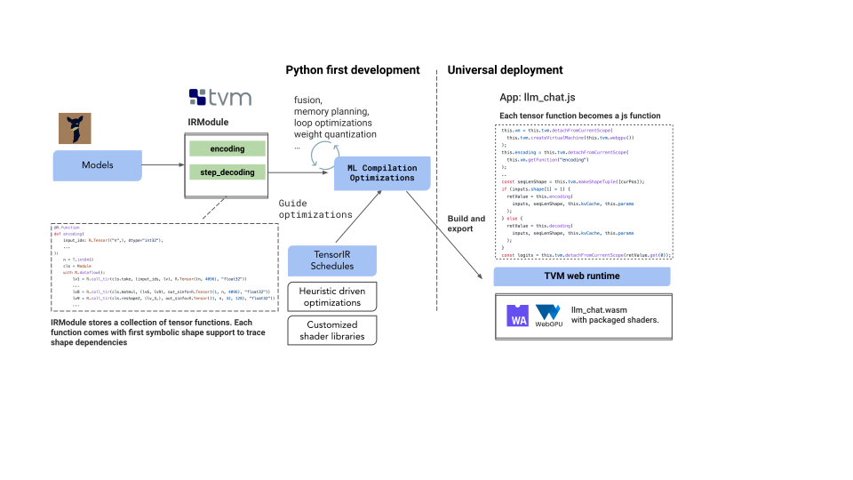

# Web LLM

This project brings language model chats directly onto web browsers. **Everything runs inside the browser with no server support and accelerated with WebGPU.** We can bring a lot of fun opportunities to build AI assistants for everyone and enable privacy while enjoying GPU acceleration.

**[Check out our demo webpage to try out!](https://mlc.ai/web-llm/)**


We have been seeing amazing progress in generative AI and LLM recently. Thanks to the open-source efforts like LLaMA, Alpaca, Vicuna, and Dolly, we can now see an exciting future of building our own open-source language models and personal AI assistant.

These models are usually big and compute-heavy. To build a chat service, we will need a large cluster to run an inference server, while clients send requests to servers and retrieve the inference output. We also usually have to run on a specific type of GPUs where popular deep-learning frameworks are readily available.

This project is our step to bring more diversity to the ecosystem. Specifically, can we simply bake LLMs directly into the client side and directly run them inside a browser? If that can be realized, we could offer support for client personal AI models with the benefit of cost reduction, enhancement for personalization, and privacy protection. The client side is getting pretty powerful. 

Won’t it be even more amazing if we can simply open up a browser and directly bring AI natively to your browser tab? There is some level of readiness in the ecosystem. WebGPU has just shipped and enables native GPU executions on the browser.

Still, there are big hurdles to cross, to name a few:

- We need to bring the models somewhere without the relevant GPU-accelerated Python frameworks.
- Most of the AI frameworks rely heavily on optimized computed libraries that are maintained by hardware vendors. We need to start from scratch.
- Careful planning of memory usage, and aggressive compression of weights so that we can fit the models into memory.

We also do not want to only do it for just one model. Instead, we would like to present a repeatable and hackable workflow that enables anyone to easily develop and optimize these models in a productive Python-first approach, and deploy them universally, including on the web.

Besides supporting WebGPU, this project also provides the harness for other kinds of GPU backends that TVM supports (such as CUDA, OpenCL, and Vulkan) and really enables accessible deployment of LLM models.


## How

The key technology here is machine learning compilation (MLC). Our solution builds on the shoulders of the open source ecosystem, including Hugging Face, model variants from LLaMA and Vicuna, wasm and WebGPU. The main flow builds on Apache TVM Unity, an exciting ongoing development in the [Apache TVM Community](https://github.com/apache/tvm/)

- We bake a language model's IRModule in TVM with native dynamic shape support, avoiding the need of padding to max length and reducing both computation amount and memory usage.
- Each function in TVM’s IRModule can be further transformed and generate runnable code that can be deployed universally on any environment that is supported by minimum tvm runtime (JavaScript being one of them).
- [TensorIR](https://arxiv.org/abs/2207.04296) is the key technique used to generate optimized programs. We provide productive solutions by quickly transforming TensorIR programs based on the combination of expert knowledge and automated scheduler.
- Heuristics are used when optimizing light-weight operators in order to reduce the engineering pressure.
- We utilize int4 quantization techniques to compress the model weights so that they can fit into memory.
- We build static memory planning optimizations to reuse memory across multiple layers.
- We use [Emscripten](https://emscripten.org/) and TypeScript to build a TVM web runtime that can deploy generated modules.
- We also leveraged a wasm port of SentencePiece tokenizer.



All parts of this workflow are done in Python, with the exception of course, of the last part that builds a 600 loc JavaScript app that connects things together. This is also a fun process of interactive development, bringing new models.

All these are made possible by the open-source ecosystem that we leverage. Specifically, we make heavy use of [TVM unity](https://discuss.tvm.apache.org/t/establish-tvm-unity-connection-a-technical-strategy/13344), an exciting latest development in the TVM project that enables such Python-first interactive MLC development experiences that allows us to easily compose new optimizations, all in Python, and incrementally bring our app to the web.

TVM unity also provides an easy way to compose new solutions in the ecosystem. We will continue to bring further optimizations such as fused quantization kernels, and bring them to more platforms.

One key characteristic of LLM models is the dynamic nature of the model. As the decoding and encoding process depends on computations that grow with the size of tokens, we leverage the first-class dynamic shape support in TVM unity that represents sequence dimensions through symbolic integers. This allows us to plan ahead to statically allocate all the memory needed for the sequence window of interest without padding.

We also leveraged the integration of tensor expressions to quickly express partial-tensor computations such as rotary embedding directly without materializing them into full-tensor matrix computations.


## Comparison to Native GPU Runtime, Limitations and Opportunities

Besides the WebGPU runtime, we also provide options for native deployment with local GPU runtime. So they can be used both as a tool to deploy on native environment as well as a reference point to compare native GPU driver performance and WebGPU.

WebGPU works by translating WGSL shaders to native shaders. We observed that there are opportunities to reach zero gap  between the WebGPU runtime and native environment.

Some of the current gaps are caused by Chrome's WebGPU implementation inserts bound clips for all array index access, such that `a[i]` becomes `a[min(i, a.size)]`. This can be optimized out as the WebGPU support continues to mature.

You can get around this by using a special flag to launch Chrome (thanks to Dawn developers for providing the pointers), by exiting Chrome completely, then in command line, type

```
/path/to/Chrome --enable-dawn-features=disable_robustness
```

Then you will find that the execution speed is as fast as native GPU environment. We anticipate this problem will get resolved as WebGPU matures. WebGPU just shipped and we are excited to see opportunities it can unblock. There are also a lot of exciting upcoming features we can leverage to further improve things such as fp16 extensions.

## Links

- [Demo page](https://mlc.ai/web-llm/)
- You might also be interested in [Web Stable Diffusion](https://github.com/mlc-ai/web-stable-diffusion/).

## Acknowledgement

This project is made possible thanks to collaboration with

<a href="https://www.scs.cmu.edu">

</a>
<a href="https://catalyst.cs.cmu.edu">

</a>
<a href="https://mlc.ai">

</a>
</br>
<a href="https://octoml.ai">

</a>
<a href="https://www.cs.washington.edu/">

</a>
<a href="https://en.sjtu.edu.cn/">

</a>

This project is only possible thanks to the shoulders open-source ecosystems that we stand on. We want to thank the Apache TVM community and developers of the TVM Unity effort. The open-source ML community members made these models publicly available. PyTorch and Hugging Face communities that make these models accessible. We would like to thank the teams behind vicuna, SentencePiece, LLaMA, Alpaca. We also would like to thank the WebAssembly, Emscripten, and WebGPU communities. Finally, thanks to Dawn and WebGPU developers.
