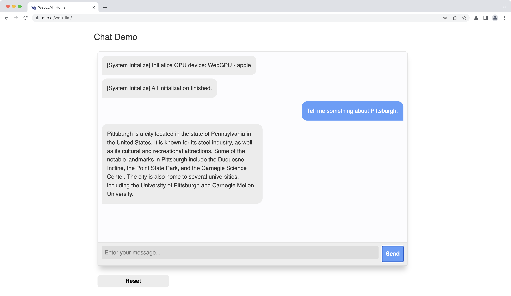

# Web LLM

**Llama 2 7B/13B are now available in Web LLM!!** Try it out in our [chat demo](#chat-demo).

**Llama 2 70B is also supported.** If you have a Apple Silicon Mac with 64GB or more memory, you can follow the [instructions](#instructions) below to download and launch Chrome Canary and try out the 70B model in Web LLM.

**Mistral 7B models and WizardMath** are all supported!

This project brings large-language model and LLM-based chatbot to web browsers. **Everything runs inside the browser with no server support and accelerated with WebGPU.** This opens up a lot of fun opportunities to build AI assistants for everyone and enable privacy while enjoying GPU acceleration. Please check out our [GitHub repo](https://github.com/mlc-ai/web-llm) to see how we did it.
You can use WebLLM as a base [npm package](https://www.npmjs.com/package/@mlc-ai/web-llm) and build your own web application on top of it by following the [documentation](https://mlc.ai/mlc-llm/docs/deploy/javascript.html).

We have been seeing amazing progress in generative AI and LLM recently. Thanks to the open-source efforts like LLaMA, Alpaca, Vicuna and Dolly, we start to see an exciting future of building our own open source language models and personal AI assistant.

These models are usually big and compute-heavy. To build a chat service, we will need a large cluster to run an inference server, while clients send requests to servers and retrieve the inference output. We also usually have to run on a specific type of GPUs where popular deep-learning frameworks are readily available.

This project is our step to bring more diversity to the ecosystem. Specifically, can we simply bake LLMs directly into the client side and directly run them inside a browser? If that can be realized, we could offer support for client personal AI models with the benefit of cost reduction, enhancement for personalization and privacy protection. The client side is getting pretty powerful.

Won’t it be even more amazing if we can simply open up a browser and directly bring AI natively to your browser tab? There is some level of readiness in the ecosystem. This project provides an affirmative answer to the question.

## Instructions

WebGPU just shipped in Chrome 113.

Select the model you want to try out. Enter your inputs, click “Send” – we are ready to go!
The chat bot will first fetch model parameters into local cache. The download may take a few minutes, only for the first run.
The subsequent refreshes and runs will be faster. We have tested it on Windows and Mac, you will need a GPU with about 6GB memory to run Llama-7B, Vicuna-7B, and about 3GB memory to run RedPajama-3B.

## Chat Demo

The chat demo is based on [Llama 2](https://ai.meta.com/llama/), [Mistral-7B](https://huggingface.co/mistralai/Mistral-7B-Instruct-v0.2) and its variants, and [RedPajama-INCITE-Chat-3B-v1](https://huggingface.co/togethercomputer/RedPajama-INCITE-Chat-3B-v1) model. More model supports are on the way.

## Links

- [Web LLM GitHub](https://github.com/mlc-ai/web-llm)
- You might also be interested in [Web Stable Diffusion](https://websd.mlc.ai/).

## Disclaimer

This demo site is for research purposes only, subject to the model License of LLaMA, Vicuna and RedPajama. Please contact us if you find any potential violation.
